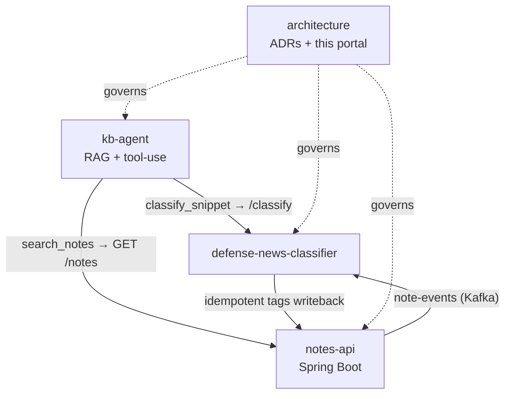

# Projects — System Portal

One place to read the whole system and jump straight to the code. Here's the shape of it —
a first static cut of the **system map** (the interactive version is `SYS-008`, Phase 2):

!!! note "How this stays honest"
    Everything below is **generated** from the source repos — read it here, but edit it
    in its home repo. See [SYS-008](decisions/SYS-008-documentation-portal.md).

## Jump in

-   **Decisions**

    The whole log in one wall — system (`SYS-*`) and per-app (`ADR-*`).

    [Open the decision wall →](decisions/index.md)

-   **System**

    Product one-pager, program view, engineering substrate, case study.

    [Open the system view →](program/README.md)

-   **Apps**

    Each service's README, docs, and decisions — one click from its source.

    [Open the apps →](apps/index.md)

-   **Telemetry**

    Quality & telemetry. Placeholder until a service is deployed (Phase 3).

    [Open telemetry →](telemetry.md)

## Repos at a glance

| Repo | Read | Code |
|------|------|------|
| **architecture** (this hub) | [Decisions](decisions/index.md) · [System](program/README.md) | [GitHub ↗](https://github.com/sanlee-ys/architecture) |
| **kb-agent** | [In portal](apps/kb-agent/index.md) | [GitHub ↗](https://github.com/sanlee-ys/kb-agent) |
| **notes-api** | [In portal](apps/notes-api/index.md) | [GitHub ↗](https://github.com/sanlee-ys/notes-api) |
| **defense-news-classifier** | [In portal](apps/defense-news-classifier/index.md) | [GitHub ↗](https://github.com/sanlee-ys/defense-news-classifier) |
| **learning-notes** | plain-language concept notes | [GitHub ↗](https://github.com/sanlee-ys/learning-notes) |
