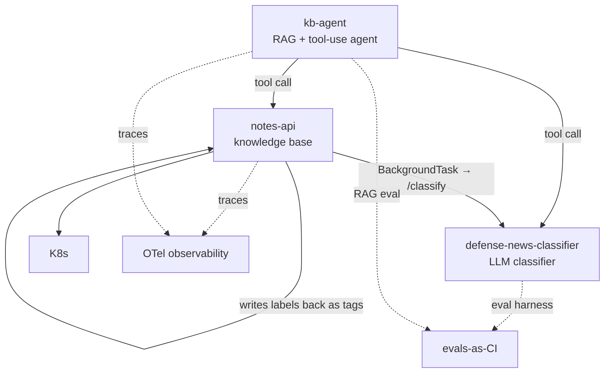

# Program View — Defense-News Intelligence

**Status:** Living
**Date:** 2026-06-28
**Author:** San Lee

The program-management companion to the [product one-pager](../product/one-pager.md): the
workstreams, how they depend on each other, what's planned, and what could go wrong. Consolidated
here for now; split into `roadmap.md` / `risks.md` once it outgrows one page.

## Workstreams

| Workstream | What it is | Repo |
|---|---|---|
| **Knowledge base** | Domain service (REST + async enrichment) that stores and serves notes | `notes-api` |
| **Classification** | LLM classifier with an eval harness | `defense-news-classifier` |
| **Agent** | RAG + tool-use agent over the system (the hub) | `kb-agent` |
| **Concepts** | Plain-language notes on the AI techniques behind the system, with an [interactive concept map](https://sanlee-ys.github.io/learning-notes/concept-map.html) | [`learning-notes`](https://sanlee-ys.github.io/learning-notes/) |
| **Cross-cutting** | ADRs, this program view, evals-as-CI, OTel observability | `architecture` (+ each repo) |

## Dependency map

The two load-bearing dependencies: **`kb-agent` can't be "one system" until `notes-api` and the
classifier are callable as tools** — the contract for this is set (`system/SYS-003`, accepted) and
**both tool seams now work** (`classify_snippet` → classifier over HTTP, frozen by `system/SYS-004`;
and `search_notes` → notes-api over HTTP, frozen by `system/SYS-006`), each enforced by contract
tests on both sides. And **the classify-and-writeback loop is now closed** — after `POST /notes`,
notes-api fires a BackgroundTask that calls `{CLASSIFIER_URL}/classify`, reads the two labels, and
writes them back as namespaced tags via `PUT /notes/{id}/tags` (`system/SYS-005`). Scaling that loop
to a durable task queue is the remaining reliability step. Everything else is cross-cutting.

## Roadmap — Now / Next / Later

**Shipped (the foundation under everything below):** `SYS-001`–`SYS-010` recorded; the three code repos wired into one system (`kb-agent` ↔ `notes-api` ↔ `defense-news-classifier`), with the tool-layer and wire contracts frozen (`SYS-003`/`SYS-004`/`SYS-006`) and contract-tested on both sides; the classify-and-writeback loop closed (`SYS-005`, idempotent namespaced writeback, R1 mitigated); CI green across all three repos; the classifier at **`v2.0.0`** (real human-labeled gold eval plus a validated Opus judge); the documentation portal live (`SYS-008`); `SYS-009` setting how work cascades across surfaces, and `SYS-010` recording the security posture; **evals-as-CI**, piloted in the classifier — its v2 capability evals now gate every PR (free offline scoring-regression gate) plus a paid weekly live-capability gate (`classifier/ADR-007`, R6 first pilot closed); and the **prompt-optimization loop (rung 1) built** — Level 3 of the autonomy ladder now shipped, not just spec'd (`classifier/ADR-005`, `classifier/ADR-006`); and the **v2 eval modules' orchestration tests backfilled** — the run-loop and `main()` coverage the pure-function tests deliberately skipped, lifting those four modules from 58–86% to 99% and overall `src/` from 90% to 97% (the `v2.0.2` hardening, riding the next tag rather than a standalone release).

### Now (in flight)
- **[product]** **Capstone narrative stub**: the last artifact of the gap-closing pass.

### Next
- **[classifier]** `v2.1.0` **scale the gold eval** with the validated judge (shrinks the n≈54 noise floor).
- **[cross-cutting]** **Evals-as-CI for `kb-agent`**: extend the pattern piloted in the classifier (`classifier/ADR-007`) to `kb-agent`'s own RAG — capability/regression evals beyond the existing deterministic shape-grader (closes the rest of R6).
- **[program]** Start the **weekly status cadence**, harvested from real progress.

### Later
- ~~**[classifier]** `v2.2.0` tiered model routing, then `v3.0.0` add a `region` field.~~ **Both shipped 2026-07-18** and should move out of *Later*: `v2.2.0` shipped as a **measured negative result** — routing moved +0 rows at ~1.97× cost, so the shipped classifier stays single-model (`classifier/ADR-013`) — and `v3.0.0` shipped the `region` field (`classifier/ADR-014`). **The `v3.0.0` schema change breached `system/SYS-004` and the breach is still open**: the coordinated `kb-agent` update the contract requires has not landed. See R8 below.
- **[classifier]** **Loop demo rung 2**: an agent-driven ML loop (a tiny AutoML) where an outer agentic loop wraps a classical TF-IDF + logreg baseline and does error-driven feature engineering against the LLM. Consumes the parked classical-ML bake-off.
- **[notes-api]** Phase 1 containerize + local K8s; Phase 2 a durable task queue (Celery + Redis or outbox) if the reliability SLA tightens beyond best-effort BackgroundTasks.
- **[cross-cutting]** ✅ **OTel tracing shipped across all three services** — the `kb-agent` tool-use loop, the classifier `/classify` LLM call, and the `notes-api` enrichment seam (opt-in per service, GenAI/HTTP semconv attributes). Drift detection over the emitted traces is the remaining observability frontier.
- **[ops]** Operational-maturity track: Linux, ssh, health checks ("can I operate what I built?").
- **[non-goal]** Other verticals (banking, etc.) — written down as a direction, not shipped.

## Risk register

| # | Risk | Severity | Mitigation / next action | Tracked in |
|---|------|----------|--------------------------|------------|
| R1 | **Duplicate enrichment / lost writeback** — BackgroundTasks is best-effort; a worker crash loses the enrichment, and a requeued task re-runs the writeback | Low | ✅ Mitigated: the writeback uses **namespaced replace**, so re-running converges to the same tags (idempotent). Lost enrichment is acceptable at this scale; upgrade path is a durable task queue (Celery + Redis). Frozen in `system/SYS-005`. *(Mechanism corrected 2026-07-18: this row previously named `PUT /notes/{id}/tags`. The background task does not make that HTTP call — it opens a fresh session and writes through the ORM directly, `notes-api/src/notes_api/tasks.py:175-182`. The idempotency claim is unaffected; `merge_tags` does the namespaced replace. `SYS-005` describes the same HTTP mechanism and needs the same correction — not done here, since it is a frozen contract and amending it is its own call.)* | `system/SYS-005`, `notes-api/ADR-001` |
| R2 | **Classifier accuracy ceiling** — category accuracy ~79%, capped by label ambiguity (industry vs. procurement), not model horsepower (*update (v2): re-measured on real, human-labeled text, category is now 88.9% / macro-F1 0.906 and operational-domain 88.9% / macro-F1 0.894 — ceiling is still label ambiguity, not the model*) | Medium | Don't escalate the model (per `system/SYS-002`); refine taxonomy or use an LLM judge on boundary cases; set the expectation in product metrics | `classifier/ADR-001`, `system/SYS-002` |
| R3 | **Breadth creep** — adding verticals/techniques without depth, eroding the through-line | Medium | "Deep on one vehicle, articulate transfer"; other verticals are an explicit non-goal; this doc + the one-pager are the guardrail | `product/one-pager.md` (Non-goals) |
| R4 | **Planning theater** — gap artifacts drift from delivery and become hollow docs | Medium | Keep artifacts thin and living; attach each to Phase 0; feed the capstone from real decisions only | this roadmap (Now/Next) |
| R5 | **Simulated program** — a solo project has no real cross-team coordination, so program evidence is simulated | Low (honesty) | Treat repos as workstreams with tracked deps; be explicit in the capstone that it's simulated, but the reasoning and artifacts are real | capstone (pending) |
| R6 | **RAG ships unmeasured** — `kb-agent` integration could go out with no quality eval | Medium | 🔄 In progress, first pilot closed: `SYS-003` sets an eval acceptance gate, the deterministic shape-grader is in `kb-agent/tests`, CI runs across all three code repos, and the classifier's v2 capability evals (`gold_eval.py`/`gold_eval_rag.py`) are now wired into CI as an enforced gate (free offline scoring-regression gate on every PR, paid weekly live-capability gate) — the evals-as-CI pattern the cross-cutting roadmap called for. `kb-agent`'s own RAG capability/regression evals (beyond the shape-grader) are the remaining piece | `classifier/ADR-007`, Next → evals-as-CI for `kb-agent` |
| R7 | **`CLASSIFIER_URL` unset silently skips enrichment** — tag writeback is a no-op when the env var is absent, which is easy to miss in a deployed environment | Low | Document the env var prominently in notes-api README; the no-op is a deliberate safe default for dev/tests, but must be set explicitly in any environment where enrichment is expected | `notes-api`, `system/SYS-005` |
| R8 | **Silent contract drift on the `/classify` seam** — classifier (provider) and `kb-agent` (consumer) are separate repos, so a renamed response field or changed enum could mis-read at runtime with nothing failing | **High — MATERIALIZED 2026-07-18, currently open** | ❌ **Not mitigated. This risk occurred.** `defense-news-classifier` shipped `v3.0.0` adding `region` to the `/classify` response (`src/api.py:63`); `kb-agent/agent/tools.py` still has no `region`, and the coordinated consumer update `SYS-004` requires has not landed (verified: no `region` branch or PR on `sanlee-ys/kb-agent`). **No build went red.** The previous "contract tests on both sides" claim was wrong in kind: each repo asserts against *its own private copy* of the shape — the provider's fixture was updated in the same commit that shipped the change, and the consumer's is a hand-written stub — so neither can observe the other. Closing this needs **one shared artifact both repos assert against** (committed JSON Schema or golden fixture). Until then, drift on this seam is silent by construction. | `system/SYS-004` (amended) |
| R9 | **Loop optimizes against the eval (Goodhart)** — the prompt-optimization loop tunes the prompt to the very metric it is scored on, so it can game the eval instead of genuinely generalizing | Medium | Mitigated by design: a 3-way split (optimize / validation / held-out real gold), with the done-signal riding the validation set and the untouched held-out number reported honestly whichever way it moves. The overfitting gap is the artifact's centerpiece, not a hidden failure | `classifier/ADR-005`, `classifier/docs/specs/prompt-optimization-loop.md` |

## On the "simulated program"

This is a solo build, so there's no real cross-team coordination to manage — the program layer is
*simulated*. That's stated plainly on purpose: the workstreams, dependencies, sequencing, and risk
reasoning are real and transferable, even though the org around them isn't. Naming the limitation is
more credible than pretending it away.
