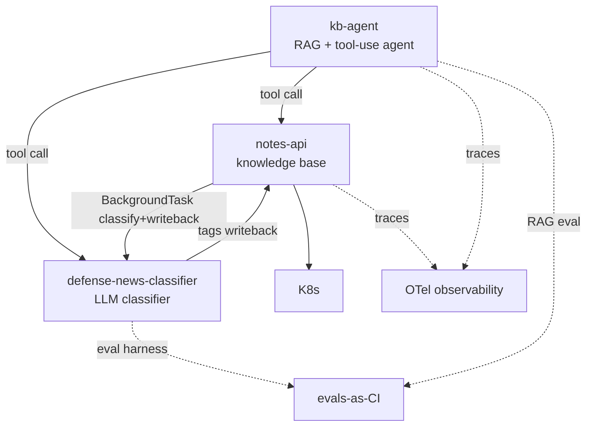

# Program View — Defense-News Intelligence

**Status:** Living
**Date:** 2026-06-23
**Author:** San Lee

The program-management companion to the [product one-pager](../product/one-pager.md): the
workstreams, how they depend on each other, what's planned, and what could go wrong. Consolidated
here for now; split into `roadmap.md` / `risks.md` once it outgrows one page.

## Workstreams

| Workstream | What it is | Repo |
|---|---|---|
| **Knowledge base** | Domain service (REST + async enrichment) that stores and serves notes | `notes-api` |
| **Classification** | LLM classifier with an eval harness | `defense-news-classifier` |
| **Agent** | RAG + tool-use agent over the system (the hub) | `kb-agent` |
| **Concepts** | Plain-language notes on the AI techniques behind the system | `learning-notes` |
| **Cross-cutting** | ADRs, this program view, evals-as-CI, OTel observability | `architecture` (+ each repo) |

## Dependency map

The two load-bearing dependencies: **`kb-agent` can't be "one system" until `notes-api` and the
classifier are callable as tools** — the contract for this is set (`system/SYS-003`, accepted) and
**both tool seams now work** (`classify_snippet` → classifier over HTTP, frozen by `system/SYS-004`;
and `search_notes` → notes-api over HTTP, frozen by `system/SYS-006`), each enforced by contract
tests on both sides. And **the classify-and-writeback loop is now closed** — after `POST /notes`,
notes-api fires a BackgroundTask that calls `{CLASSIFIER_URL}/classify`, reads the two labels, and
writes them back as namespaced tags via `PUT /notes/{id}/tags` (`system/SYS-005`). Scaling that loop
to a durable task queue is the remaining reliability step. Everything else is cross-cutting.

## Roadmap — Now / Next / Later

### Now (in flight)
- **[product]** Product one-pager — ✅ done · [`product/one-pager.md`](../product/one-pager.md)
- **[program]** This program view — 🔄 in progress
- **[kb-agent]** `SYS-003` tool-layer contract — ✅ accepted **and implemented** · [`decisions/SYS-003`](../decisions/SYS-003-agent-tool-layer-contract.md); all three tools return the observation shape via `_success`/`_problem`, an `_obs()` grader enforces it, and the classifier seam (`classify_snippet`) is shipped and verified
- **[kb-agent]** `SYS-002` model tier — ✅ implemented · `kb-agent` defaults to `claude-sonnet-4-6` per [`decisions/SYS-002`](../decisions/SYS-002-model-tier-standard.md), with a `KB_AGENT_MODEL` env knob to escalate without code changes
- **[cross-cutting]** `SYS-004` `/classify` wire contract — ✅ accepted · [`decisions/SYS-004`](../decisions/SYS-004-classify-http-contract.md); the classifier↔kb-agent HTTP seam is frozen and enforced by contract tests on both sides (see R6-adjacent drift risk, now mitigated)
- **[cross-cutting]** Evals-as-CI — 🔄 the `SYS-003` tool-layer eval gate is in place (deterministic shape-grader in `kb-agent/tests`) and **CI now runs across all three code repos** (defense-news-classifier, kb-agent, notes-api); capability/regression evals next
- **[product]** Capstone narrative stub — ⬜ last artifact of the gap-closing pass
- **[notes-api]** Tag the REST baseline (`v1-rest-baseline`) before event-driven work begins

### Next (right after the gap pass)
- **[notes-api + classifier]** **Phase 0 classify-and-writeback loop — ✅ closed.** `notes-api`
  (Python/FastAPI, `uv` toolchain) enqueues a `BackgroundTask` on `POST /notes` → calls
  `{CLASSIFIER_URL}/classify` → reads `{category, operational_domain}` → writes labels back as
  **namespaced** tags via an **idempotent** `PUT /notes/{id}/tags`. `CLASSIFIER_URL` unset =
  no-op (safe default for dev/tests). Contract frozen in
  [`system/SYS-005`](../decisions/SYS-005-event-loop-contract.md); closes R1;
  `v1-rest-baseline` tagged before the work began.
- **[classifier]** **Classify-and-writeback integration test** — ✅ done · unit tests cover the
  `classify_and_writeback` task path (mock classifier + mock writeback), proving the wire contract
  without a live service.
- **[notes-api]** **Router/schema tests** — ✅ done · FastAPI TestClient tests assert the
  `GET /notes`, `POST /notes`, and `PUT /notes/{id}/tags` shapes, run in CI via `uv run pytest`.
- **[program]** Start the **weekly status cadence**, harvested from real progress.

### Later
- **[notes-api]** Phase 1 — containerize + local K8s; Phase 2 — explore durable task queue
  (Celery + Redis or outbox) if reliability SLA tightens beyond best-effort BackgroundTasks.
- **[kb-agent]** Add a `notes-api` tool — ✅ done · `search_notes` GETs notes-api's `/notes` over
  HTTP (returning the `SYS-003` observation shape), so the agent reads the knowledge base through the
  service that owns it, not a static stub. Read contract frozen in
  [`system/SYS-006`](../decisions/SYS-006-notes-read-contract.md), tested on both sides — the **last
  unbuilt edge in the dependency map is now wired**.
- **[cross-cutting]** OTel observability across `notes-api` + `kb-agent`.
- **[ops]** Operational-maturity track — Linux, ssh, health checks ("can I operate what I built?").
- **[non-goal]** Other verticals (banking, etc.) — **articulated, not built**.

## Risk register

| # | Risk | Severity | Mitigation / next action | Tracked in |
|---|------|----------|--------------------------|------------|
| R1 | **Duplicate enrichment / lost writeback** — BackgroundTasks is best-effort; a worker crash loses the enrichment, and a requeued task re-runs the writeback | Low | ✅ Mitigated: the writeback uses **namespaced replace** (`PUT /notes/{id}/tags`), so re-running converges to the same tags (idempotent). Lost enrichment is acceptable at this scale; upgrade path is a durable task queue (Celery + Redis). Frozen in `system/SYS-005` | `system/SYS-005`, `notes-api/ADR-001` |
| R2 | **Classifier accuracy ceiling** — category accuracy ~79%, capped by label ambiguity (industry vs. procurement), not model horsepower (*update (v2): re-measured on real, human-labeled text, category is now 88.9% / macro-F1 0.906 and operational-domain 88.9% / macro-F1 0.894 — ceiling is still label ambiguity, not the model*) | Medium | Don't escalate the model (per `system/SYS-002`); refine taxonomy or use an LLM judge on boundary cases; set the expectation in product metrics | `classifier/ADR-001`, `system/SYS-002` |
| R3 | **Breadth creep** — adding verticals/techniques without depth, eroding the through-line | Medium | "Deep on one vehicle, articulate transfer"; other verticals are an explicit non-goal; this doc + the one-pager are the guardrail | `product/one-pager.md` (Non-goals) |
| R4 | **Planning theater** — gap artifacts drift from delivery and become hollow docs | Medium | Keep artifacts thin and living; attach each to Phase 0; feed the capstone from real decisions only | this roadmap (Now/Next) |
| R5 | **Simulated program** — a solo project has no real cross-team coordination, so program evidence is simulated | Low (honesty) | Treat repos as workstreams with tracked deps; be explicit in the capstone that it's simulated, but the reasoning and artifacts are real | capstone (pending) |
| R6 | **RAG ships unmeasured** — `kb-agent` integration could go out with no quality eval | Medium | 🔄 In progress: `SYS-003` sets an eval acceptance gate, the deterministic shape-grader is in `kb-agent/tests`, and **CI now runs across all three code repos**; next, add capability/regression evals | Now → evals-as-CI |
| R7 | **`CLASSIFIER_URL` unset silently skips enrichment** — tag writeback is a no-op when the env var is absent, which is easy to miss in a deployed environment | Low | Document the env var prominently in notes-api README; the no-op is a deliberate safe default for dev/tests, but must be set explicitly in any environment where enrichment is expected | `notes-api`, `system/SYS-005` |
| R8 | **Silent contract drift on the `/classify` seam** — classifier (provider) and `kb-agent` (consumer) are separate repos, so a renamed response field or changed enum could mis-read at runtime with nothing failing | Medium | ✅ Mitigated: `system/SYS-004` freezes the wire contract and ties a breaking-change → MAJOR-bump + coordinated-update rule to it; **contract tests on both sides** (in CI) turn any drift into a red build | `system/SYS-004` |

## On the "simulated program"

This is a solo build, so there's no real cross-team coordination to manage — the program layer is
*simulated*. That's stated plainly on purpose: the workstreams, dependencies, sequencing, and risk
reasoning are real and transferable, even though the org around them isn't. Naming the limitation is
more credible than pretending it away.
