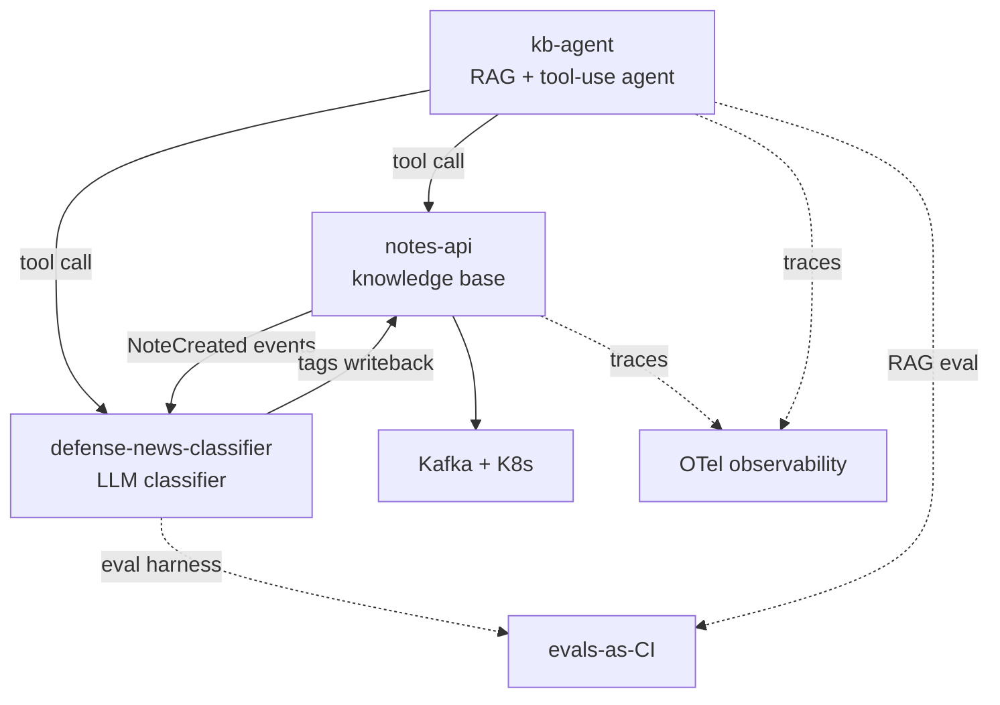

# Program View — Defense-News Intelligence

**Status:** Living
**Date:** 2026-06-21
**Author:** San Lee

The program-management companion to the [product one-pager](../product/one-pager.md): the
workstreams, how they depend on each other, what's planned, and what could go wrong. Consolidated
here for now; split into `roadmap.md` / `risks.md` once it outgrows one page.

## Workstreams

| Workstream | What it is | Repo |
|---|---|---|
| **Knowledge base** | Domain service (REST → event-driven) that stores and serves notes | `notes-api` |
| **Classification** | LLM classifier with an eval harness | `defense-news-classifier` |
| **Agent** | RAG + tool-use agent over the system (the hub) | `kb-agent` |
| **Concepts** | Plain-language notes on the AI techniques behind the system | `learning-notes` |
| **Cross-cutting** | ADRs, this program view, evals-as-CI, OTel observability | `architecture` (+ each repo) |

## Dependency map

The two load-bearing dependencies: **`kb-agent` can't be "one system" until `notes-api` and the
classifier are callable as tools** — the contract for this is set (`system/SYS-003`, accepted) and
the **classifier seam already works** (`classify_snippet` over HTTP); the `notes-api` seam is what's
left. And **`notes-api` going event-driven pulls in Kafka + K8s and makes the classifier a
consumer.** Everything else is cross-cutting.

## Roadmap — Now / Next / Later

### Now (in flight)
- **[product]** Product one-pager — ✅ done · [`product/one-pager.md`](../product/one-pager.md)
- **[program]** This program view — 🔄 in progress
- **[kb-agent]** `SYS-003` tool-layer contract — ✅ accepted · [`decisions/SYS-003`](../decisions/SYS-003-agent-tool-layer-contract.md); the classifier seam (`classify_snippet`) is shipped and verified
- **[cross-cutting]** Evals-as-CI — 🔄 starting with the `SYS-003` tool-layer eval gate (deterministic shape-grader already in `kb-agent/tests`); capability/regression evals + CI wiring next
- **[product]** Capstone narrative stub — ⬜ last artifact of the gap-closing pass
- **[notes-api]** Tag the REST baseline (`v1-rest-baseline`) before event-driven work begins

### Next (right after the gap pass)
- **[notes-api]** **Phase 0 — make notes-api event-driven:** local Kafka (KRaft) + kafka-ui smoke
  test → publish `NoteCreated` → classifier as a `@KafkaListener` consumer → close the loop with an
  **idempotent** tags writeback → ADR + baseline.
- **[classifier]** Kafka consumer for the event loop. (The HTTP `/classify` service for `kb-agent`
  tool-use is ✅ done — `kb-agent` already calls it via `classify_snippet`.)
- **[program]** Start the **weekly status cadence**, harvested from real progress.

### Later
- **[notes-api]** Phase 1 — containerize + local K8s; Phase 2 — Kafka on K8s via Strimzi
  (StatefulSets, operator pattern).
- **[kb-agent]** Add a `notes-api` tool — the remaining `SYS-003` seam (the contract and the
  classifier seam are done), so the agent reads the knowledge base through its own service.
- **[cross-cutting]** OTel observability across `notes-api` + `kb-agent`.
- **[ops]** Operational-maturity track — Linux, ssh, health checks ("can I operate what I built?").
- **[non-goal]** Other verticals (banking, etc.) — **articulated, not built**.

## Risk register

| # | Risk | Severity | Mitigation / next action | Tracked in |
|---|------|----------|--------------------------|------------|
| R1 | **Duplicate event processing** — at-least-once delivery means the consumer may see a `NoteCreated` twice, double-classifying / double-writing tags | High | Idempotent consumer: dedupe by event key/offset, **upsert** tags (not append). Decide & record as an ADR in Phase 0 | notes-api → ADR (pending) |
| R2 | **Classifier accuracy ceiling** — category accuracy ~79%, capped by label ambiguity (industry vs. procurement), not model horsepower | Medium | Don't escalate the model (per `system/SYS-002`); refine taxonomy or use an LLM judge on boundary cases; set the expectation in product metrics | `classifier/ADR-001`, `system/SYS-002` |
| R3 | **Breadth creep** — adding verticals/techniques without depth, eroding the through-line | Medium | "Deep on one vehicle, articulate transfer"; other verticals are an explicit non-goal; this doc + the one-pager are the guardrail | `product/one-pager.md` (Non-goals) |
| R4 | **Planning theater** — gap artifacts drift from delivery and become hollow docs | Medium | Keep artifacts thin and living; attach each to Phase 0; feed the capstone from real decisions only | this roadmap (Now/Next) |
| R5 | **Simulated program** — a solo project has no real cross-team coordination, so program evidence is simulated | Low (honesty) | Treat repos as workstreams with tracked deps; be explicit in the capstone that it's simulated, but the reasoning and artifacts are real | capstone (pending) |
| R6 | **RAG ships unmeasured** — `kb-agent` integration could go out with no quality eval | Medium | 🔄 In progress: `SYS-003` sets an eval acceptance gate and the deterministic shape-grader is in `kb-agent/tests`; next, add capability/regression evals + wire CI | Now → evals-as-CI |
| R7 | **Toolchain friction** — `JAVA_HOME` not set system-wide could stall notes-api builds | Low | Set per-shell or document the build command in the repo README | notes-api |

## On the "simulated program"

This is a solo build, so there's no real cross-team coordination to manage — the program layer is
*simulated*. That's stated plainly on purpose: the workstreams, dependencies, sequencing, and risk
reasoning are real and transferable, even though the org around them isn't. Naming the limitation is
more credible than pretending it away.
