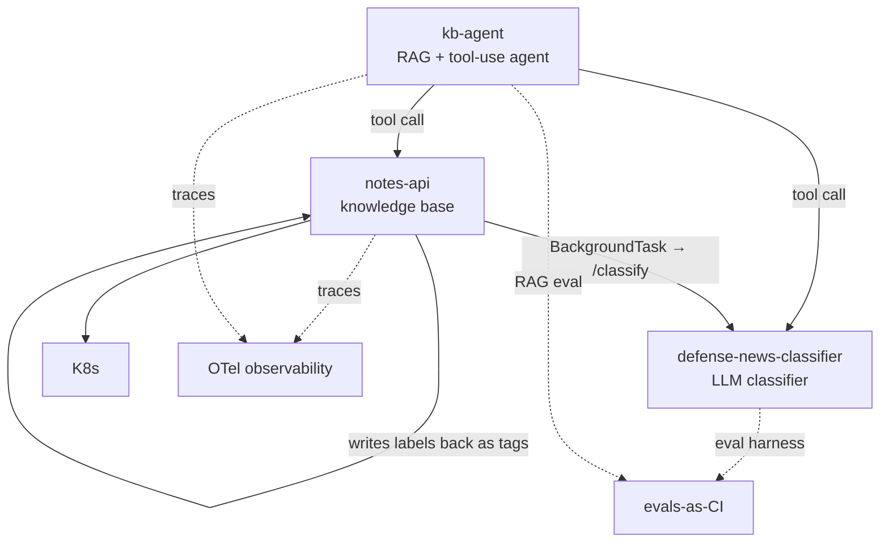

# Program View — Defense-News Intelligence

**Status:** Living
**Date:** 2026-09-09
**Author:** San Lee

The program-management companion to the [product one-pager](../product/one-pager.md): the
workstreams, how they depend on each other, what's planned, and what could go wrong. Consolidated
here for now; split into `roadmap.md` / `risks.md` once it outgrows one page.

## Workstreams

| Workstream | What it is | Repo |
|---|---|---|
| **Knowledge base** | Domain service (REST + async enrichment) that stores and serves notes | `notes-api` |
| **Classification** | LLM classifier with an eval harness | `defense-news-classifier` |
| **Agent** | RAG + tool-use agent over the system (the hub) | `kb-agent` |
| **Concepts** | Plain-language notes on the AI techniques behind the system, with an [interactive concept map](https://sanlee-ys.github.io/learning-notes/concept-map.html) | [`learning-notes`](https://sanlee-ys.github.io/learning-notes/) |
| **Cross-cutting** | ADRs, this program view, evals-as-CI, OTel observability | `architecture` (+ each repo) |

## Dependency map

```mermaid
graph TD
  kb["kb-agent<br/>RAG + tool-use agent"]
  notes["notes-api<br/>knowledge base"]
  clf["defense-news-classifier<br/>LLM classifier"]
  infra["K8s"]
  evals["evals-as-CI"]
  otel["OTel observability"]

  kb -->|tool call| notes
  kb -->|tool call| clf
  notes -->|BackgroundTask → /classify| clf
  notes -->|writes labels back as tags| notes
  notes --> infra
  clf -.->|eval harness| evals
  kb -.->|RAG eval| evals
  notes -.->|traces| otel
  kb -.->|traces| otel
```

The two load-bearing dependencies: **`kb-agent` can't be "one system" until `notes-api` and the
classifier are callable as tools** — the contract for this is set (`system/SYS-003`, accepted) and
**both tool seams now work** (`classify_snippet` → classifier over HTTP, frozen by `system/SYS-004`;
and `search_notes` → notes-api over HTTP, frozen by `system/SYS-006`), each enforced by contract
tests on both sides. And **the classify-and-writeback loop is now closed** — after `POST /notes`,
notes-api enqueues a SQLite outbox job that calls `{CLASSIFIER_URL}/classify` and
writes the labels back as namespaced tags (`system/SYS-005`, `notes-api/ADR-003`).
The job survives a process restart. Everything else is cross-cutting.

## Roadmap — Now / Next / Later

**Shipped (the foundation under everything below):** `SYS-001`–`SYS-010` recorded; the three code repos wired into one system (`kb-agent` ↔ `notes-api` ↔ `defense-news-classifier`), with the tool-layer and wire contracts frozen (`SYS-003`/`SYS-004`/`SYS-006`) and contract-tested on both sides; the classify-and-writeback loop closed (`SYS-005`, idempotent namespaced writeback, R1 mitigated); CI green across all three repos; the classifier at <!-- version:classifier -->**v3.2.1** (three-axis output, human-labeled gold eval plus a validated Opus judge, the autonomy ladder built and measured end to end at L1–L4, every axis measured at n=300 as well as on the n=54 human gold set, and the `global`-boundary prompt clause adopted after a pre-registered re-run cleared all four of its rules at n=595 — `classifier/ADR-024`); the documentation portal live (`architecture/ADR-001`, then `SYS-008`); `SYS-009` setting how work cascades across surfaces, and `SYS-010` recording the security posture; **evals-as-CI**, piloted in the classifier — its v2 capability evals now gate every PR (free offline scoring-regression gate) plus a paid weekly live-capability gate (`classifier/ADR-007`, R6 first pilot closed); and the **prompt-optimization loop (rung 1) built** — Level 3 of the autonomy ladder now shipped, not just spec'd (`classifier/ADR-005`, `classifier/ADR-006`); and the **v2 eval modules' orchestration tests backfilled** — the run-loop and `main()` coverage the pure-function tests deliberately skipped, lifting those four modules from 58–86% to 99% and overall `src/` from 90% to 97% (the `v2.0.2` hardening, riding the next tag rather than a standalone release).

**Shipped 2026-09-09 (moved out of Later / Now):** OpenTelemetry tracing across the three services (opt-in, GenAI/HTTP semconv). Loop demo rung 2 (the agent-driven ML loop; the live run gamed its own metric and the eval caught it; the portfolio autonomy-ladder page records it shipped, 2026). Classifier `v2.2.0` (measured negative routing result, `classifier/ADR-013`) and `v3.0.0` (`region` field, `classifier/ADR-014`); the SYS-004 breach closed 2026-07-19. Capstone narrative: the portfolio product-and-program page is that artifact. Local deploy Phase 1: `deploy/` compose and kind manifests in this repo. Weekly status cadence: `scripts/weekly_status.py` harvests merged PRs; `.github/workflows/weekly-status.yml` runs on Monday 12:00 UTC. SYS-023 records the OTel span-name contract. The three `contracts/otel-spans.json` files shipped the same day (`kb-agent` #113, `notes-api` #58, `defense-news-classifier` #203).

**Shipped 2026-09-09 (this close):** Durable SQLite outbox (`notes-api` #58, `notes-api/ADR-003`). Dockerfiles for notes-api and kb-agent, with `/health` smoke. kb-agent SYS-017 **tier 2** (`kb-agent` #113, `kb-agent/ADR-013`): floors, gate script, CI step. The required status check is the existing `test` job; the gate is a step inside it, so a floor breach already blocks merge.

### Now (in flight)
- None. The 2026-09-09 wave closed the open Now rows.

### Next
- ~~**[classifier]** `v2.1.0` **scale the gold eval** with the validated judge (shrinks the n≈54 noise floor).~~ **Shipped 2026-07-17** — 300 judge-graded DVIDS snippets, category 93.3% [89.9, 95.6] and domain 90.3% [86.5, 93.2], roughly halving the n=54 CI width. *This sat under "Next" until 2026-07-19: the release carried no `Downstream surfaces` section naming this file, so nothing swept it.* ~~The successor is **scale the *region* eval** — unblocked (judge-vs-human region agreement <!-- metric:judge_region_agreement -->96.3%) but unscheduled.~~ **Shipped 2026-08-02 as `v3.2.0`** — the judge cleared `classifier/ADR-014`'s gate on that agreement figure (a perfect score at the time; the marker above tracks the live artifact, which moved when `v3.2.1` re-ran the gold set), and the n=300 run then narrowed the region interval from 18 points to 7 and sized the one named error cluster the region axis has. **That cluster was then closed as far as a prompt can close it**: the fix was measured, reverted as marginal, re-run at double the power, and adopted as `v3.2.1` (`classifier/ADR-023` → `classifier/ADR-024`). The figures are deliberately **not** restated here: they are a frozen dated measurement living in the classifier's own artifacts (`evals/scale_eval_v3.txt`, `evals/region_clause_rerun.txt`), and this repo points at them rather than quoting numbers it cannot assert against — `evals/metrics.json` publishes the n=54 gold block only.
- ~~**[kb-agent]** **Evals-as-CI tier 2** (floors + gate).~~ **Shipped 2026-09-09** (`kb-agent` #113, `kb-agent/ADR-013`). Floors sit at recall@1 0.88 / recall@5 0.92 / MRR 0.90 on both arms (two-miss margin under the 0.963 operating point). The `test` job is already a required status check; the gate runs inside it. R6 closes.

### Later
- **[ops]** Operational-maturity track: Linux, ssh, and operate-what-you-built beyond the local compose and kind manifests in `deploy/` (Phase 1 shipped 2026-09-09).
- **[non-goal]** Other verticals (banking, etc.) — written down as a direction, not shipped.

## Weekly status

`scripts/weekly_status.py` lists pull requests that merged in the last 7 days
in `sanlee-ys/{kb-agent,notes-api,defense-news-classifier,architecture}`.
`.github/workflows/weekly-status.yml` runs at Monday 12:00 UTC and on
`workflow_dispatch`. The job writes `program/weekly/YYYY-MM-DD.md` and opens
a PR. An empty week still writes a file that says zero merged PRs.

The default `GITHUB_TOKEN` can push a branch and open that PR only when the
repo setting "Allow GitHub Actions to create and approve pull requests" is
on, and when the workflow has `contents: write` and `pull-requests: write`.
If the token cannot push, the job opens a GitHub Issue with the same body.

## Risk register

| # | Risk | Severity | Mitigation / next action | Tracked in |
|---|------|----------|--------------------------|------------|
| R1 | **Duplicate enrichment / lost writeback** — a crash after `POST /notes` used to drop in-memory `BackgroundTasks` | Low | ✅ Mitigated twice: namespaced replace keeps re-runs idempotent (`SYS-005`); the SQLite outbox (`notes-api/ADR-003`, 2026-09-09) survives a process restart. Frozen writeback contract is unchanged. | `system/SYS-005`, `notes-api/ADR-003` |
| R2 | **Classifier accuracy ceiling** — capped by label ambiguity, not model horsepower. At `v3.2.1` (n=54 gold): category <!-- metric:category_accuracy -->**94.4%** / macro-F1 <!-- metric:category_macro_f1 -->0.930, operational-domain <!-- metric:domain_accuracy -->**98.1%** / macro-F1 <!-- metric:domain_macro_f1 -->0.982, region <!-- metric:region_accuracy -->**94.4%** / macro-F1 <!-- metric:region_macro_f1 -->0.975. The ceiling claim held across three versions, and two measured escalations were *declined* on the strength of it — BM25 grounding (`classifier/ADR-012`) and tiered routing (`classifier/ADR-013`), the latter at ~1.97x cost for +0 rows. **`v3.2.1` is the first release to move it, and it moved it with a prompt clause rather than a model**: the region axis's second ceiling mechanism was one named cluster (gold `global` pulled to a specific region — the no-guessing rule, not label overlap), and a one-bullet clause closing it was pre-registered, measured, reverted as marginal, re-run at double the power and adopted (`classifier/ADR-024`). That sharpens the risk rather than retiring it: what remains is label ambiguity proper, and the residual region errors have *inverted* into over-calls of `global`. *(Numbers restated 2026-08-03 for `v3.2.1`. They are asserted against the classifier's generated `evals/metrics.json` by `scripts/check_program_metrics.py` — do not retype them by hand.)* | Medium | Don't escalate the model (per `system/SYS-002`); refine taxonomy or use an LLM judge on boundary cases; set the expectation in product metrics | `classifier/ADR-001`, `system/SYS-002` |
| R3 | **Breadth creep** — adding verticals/techniques without depth, eroding the through-line | Medium | "Deep on one vehicle, articulate transfer"; other verticals are an explicit non-goal; this doc + the one-pager are the guardrail | `product/one-pager.md` (Non-goals) |
| R4 | **Planning theater** — gap artifacts drift from delivery and become hollow docs | Medium | Keep artifacts thin and living; attach each to Phase 0; feed the capstone from real decisions only | this roadmap (Now/Next) |
| R5 | **Simulated program** — a solo project has no real cross-team coordination, so program evidence is simulated | Low (honesty) | Treat repos as workstreams with tracked deps; be explicit in the capstone that it's simulated, but the reasoning and artifacts are real. The capstone is the portfolio product-and-program page (shipped as that page, 2026-09-09). | `portfolio/projects/product-and-program.html` |
| R6 | **RAG ships unmeasured** — `kb-agent` integration could go out with no quality eval | Medium | ✅ Closed 2026-09-09. Corpus provenance shipped 2026-08-02 (`kb-agent/ADR-012`, SYS-017 tier 1). Floors, gate script, and CI step shipped 2026-09-09 (`kb-agent/ADR-013`, `kb-agent` #113, SYS-017 tier 2). Floors: overall recall@1 0.88 / recall@5 0.92 / MRR 0.90 on both arms, two misses under the 0.963 CI operating point. The required check is the existing `test` job; the gate is a step inside it, so a floor breach blocks merge. | `classifier/ADR-007`, `system/SYS-017`, `kb-agent/ADR-012`, `kb-agent/ADR-013` |
| R7 | **`CLASSIFIER_URL` unset silently skips enrichment** — tag writeback is a no-op when the env var is absent, which is easy to miss in a deployed environment | Low | Document the env var prominently in notes-api README; the no-op is a deliberate safe default for dev/tests, but must be set explicitly in any environment where enrichment is expected | `notes-api`, `system/SYS-005` |
| R8 | **Silent contract drift on the `/classify` seam** — classifier (provider) and `kb-agent` (consumer) are separate repos, so a renamed response field or changed enum could mis-read at runtime with nothing failing | **High — materialized 2026-07-18, CLOSED 2026-07-19** | ✅ **Mitigated, the hard way — it occurred first.** `defense-news-classifier` shipped `v3.0.0` adding `region` to the `/classify` response with no coordinated consumer update, and **no build went red**. The root cause was that the "contract tests on both sides" claim was wrong in kind: each repo asserted against *its own private copy* of the shape, so neither could observe the other. **Closed 2026-07-19** by the shared-artifact fix this row called for: the provider publishes `contracts/classify-response.schema.json` and consumers fetch and assert against it (`SYS-018`); `kb-agent/agent/tools.py` now carries all three fields. **Residual, deliberately accepted:** the consumer check fails *open* — an unreachable or unpublished schema warns and passes rather than reddening an unrelated build. Drift is loud when the artifact is reachable, silent otherwise. See the [`SYS-004` closure note](../decisions/SYS-004-classify-http-contract.md#closure-2026-07-19). | `system/SYS-004` (amended) |
| R9 | **Loop optimizes against the eval (Goodhart)** — the prompt-optimization loop tunes the prompt to the very metric it is scored on, so it can game the eval instead of genuinely generalizing | Medium | Mitigated by design: a 3-way split (optimize / validation / held-out real gold), with the done-signal riding the validation set and the untouched held-out number reported honestly whichever way it moves. The overfitting gap is the artifact's centerpiece, not a hidden failure | `classifier/ADR-005`, `classifier/docs/specs/prompt-optimization-loop.md` |

## On the "simulated program"

This is a solo build, so there's no real cross-team coordination to manage — the program layer is
*simulated*. That's stated plainly on purpose: the workstreams, dependencies, sequencing, and risk
reasoning are real and transferable, even though the org around them isn't. Naming the limitation is
more credible than pretending it away.
